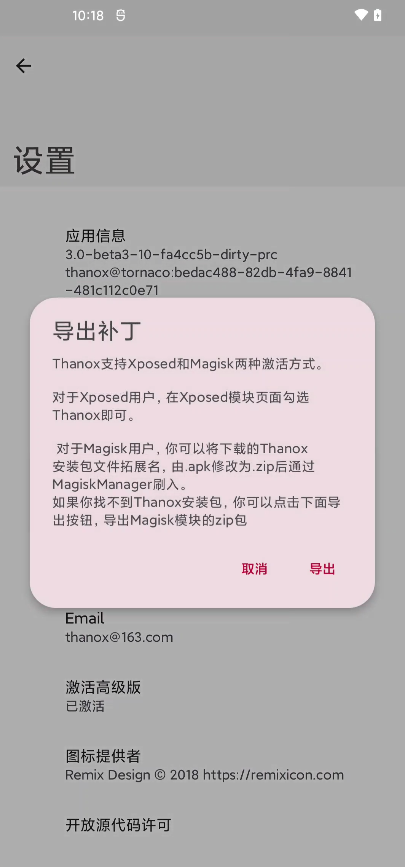

## 安装

1. Thanox是一个独立的apk，只需要下载apk安装到设备上即可。
2. 目前仅支持**Android 6.0及其以上**版本的ROM。
3. 开发基于**AOSP**开发，理论上兼容所有类原生以及其他大部分国产ROM。

&nbsp;

## 激活

Thanox中大部分的功能都是在系统进程中完成的，因此Thanox会对Android系统打补丁。

目前支持两种模式激活（二选一）：

* Xposed模式， Android6+
* Magisk模式，Android11+，实验性，目前功能相对较少

&nbsp;

### Xposed模式

1. 你的设备必须已经正确安装了**Xposed框架**（或者其他类似支持Xposed API的框架）
2. 安装Thanox apk后，进入**Xposed installer**应用，勾选Thanox
3. 勾选完成，重启设备
4. 对于支持作用域的Xposed框架，请至少勾选Android系统，如要对某个app启用隐匿功能，则还需要勾选目标app

**注意，每次更新Thanox后，建议都重新勾选Thanox后重启**

&nbsp;

### Magisk模式(实验)

1. 你的设备必须已经正确安装了**Magisk框架**
2. 你的设备必须已经正确安装了**riru**框架
3. 安装最新Thanox 应用
4. 点击Thaox设置--关于--补丁状态，导出magisk补丁；或者直接将thanox apk重命名为.zip格式即为magisk补丁
5. 刷入上个步骤获取到的magisk补丁

**注意，每次更新Thanox，都需要更新magisk补丁。**

&nbsp;

&nbsp;

----------------

**导出页面如图所示：**

