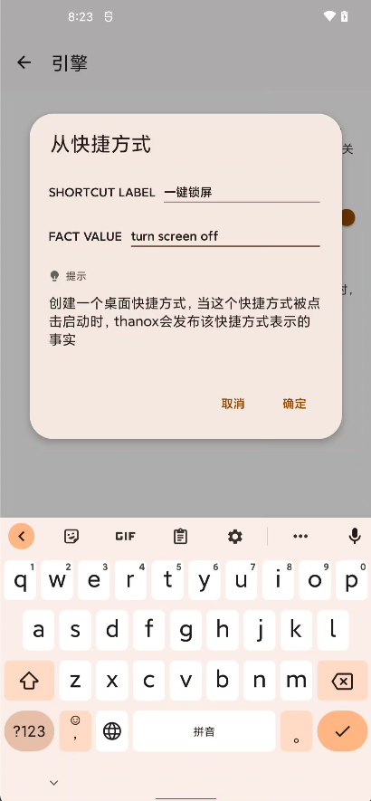

## 0.1. 前言

规则引擎：https://github.com/j-easy/easy-rules


> You can build a simple rules engine yourself. All you need is to create a bunch of objects with conditions and actions, store them in a collection, and run through them to evaluate the conditions and execute the actions.
>
> [Martin Fowler](http://martinfowler.com/) 

&nbsp;

&nbsp;

## 0.2. 介绍

情景模式简单理解：

> 什么时候，干什么。

什么时候就是触发条件（condition）

干什么就是动作（actions）

&nbsp;

&nbsp;

## 0.3. 新建

新建一条入门实例如下，以JSON格式为例：

```json
[
  {
    "name": "Current pkg",
    "description": "应用切换时，使用Toast显示当前应用的当前应用包名",
    "priority": 2,
    "condition": "frontPkgChanged == true",
    "actions": [
      "ui.showShortToast(activity.getFrontAppPackage());"
    ]
  }
]
```

参数解释：

| 参数名      | 含义                                                         |
| ----------- | ------------------------------------------------------------ |
| name        | 请使用英文，情景模式名字，多个模式不能重复，否则会被覆盖     |
| description | 任意的描述                                                   |
| priority    | 优先级，决定执行顺序                                         |
| condition   | 触发条件，支持mvel表达式，条件可选的基于事实的facts-param请参考下面的章节<br />语法注意：双引号需要使用\转移字符转义 |
| actions     | 要执行的动作，支持[mvel表达式](http://mvel.documentnode.com) ，可以设置多个，动作可选的handle请参考下面的章节<br />语法注意：双引号需要使用\转移字符转义 |

&nbsp;

&nbsp;

## 0.4. Fatcs-params

除了提供规则引擎之外，Thanox也会提供常用的事实与参数，用于condition条件判断。

&nbsp;

### 0.4.1. 应用安装

应用安装成功之后，thanox会发布这个事实，并注入一些参数，你可以使用这些参数做条件判断，或者执行动作时作为参数使用。

| 参数名   | 类型                  | 含义           | 示例 |
| -------- | --------------------- | -------------- | ---- |
| pkgAdded | Boolean（true/false） | 新应用已经安装 | 如下 |
| pkgName  | String（字符串）      | 安装的应用包名 | 如下 |

**pkgAdded** 示例

- 作为条件判断：

  ```json
  "condition":  "pkgAdded == true"
  ```

**pkgName**示例

* 作为条件判断：

  ```json
  "condition":  "pkgAdded == true && pkgName == \"com.tencent.mm\""
  ```

* 作为动作参数：

  ```json
  "ui.showShortToast(pkgName);"
  ```

  &nbsp;

### 0.4.2. 应用切换

前台应用切换时，thanox也会发布这个事实，参数如下。

| 参数名          | 类型                  | 含义                   | 示例 |
| --------------- | --------------------- | ---------------------- | ---- |
| frontPkgChanged | Boolean（true/false） | 前台应用已切换         | 如下 |
| from            | String（字符串）      | 从哪个应用切换的，包名 | 如下 |
| to              | String（字符串）      | 切换到哪个应用，包名   | 略   |

**frontPkgChanged**示例

* 作为条件判断：

  ```json
  "condition":  "frontPkgChanged == true"
  ```

**from**示例

* 作为条件判断，微信是否回到了后台：

  ```json
  "condition":  "frontPkgChanged == true && from == \"com.tencent.mm\""
  ```

  &nbsp;

### 0.4.3. 任务清理

当某个应用的任务被移除时，一般场景为最近任务中，该任务被用户划掉。此时thanox也会发布这个事实，参数如下。

| 参数名      | 类型                  | 含义                   | 示例 |
| ----------- | --------------------- | ---------------------- | ---- |
| taskRemoved | Boolean（true/false） | 任务已移除             | 如下 |
| pkgName     | String（字符串）      | 从哪个应用切换的，包名 | 如下 |

**taskRemoved**示例

* 作为条件判断：

  ```json
  "condition":  "taskRemoved == true"
  ```

**pkgName**示例：

* 作为条件判断，微信任务移除时杀死应用：

  ```json
  "condition":  "taskRemoved == true && pkgName == \"com.tencent.mm\""，
  "actions": [
    		"ui.showShortToast(\"正在杀死微信\");",
        "killer.killPackage(pkgName);"
      ]
  ```


&nbsp;

### 0.4.4. Activity Created

通常一个应用的活动页已经创建好，可以称为**Activity Created**。此时thanox也会发布这个事实，参数如下。
通常一个活动的生命周期为Created（创建好）-->Resumed（显示好，可以交互了）--> Paused（暂停）--> Destroyed（销毁了），需要注意的是，

如果一个活动走到Resumed状态时，被其他活动覆盖，例如被支付宝支付页面覆盖，那么它会走如下生命周期：
Resumed--> Paused（被其他活动覆盖）-->Resumed（如果其他活动销毁了，回到了该活动，那么又会恢复到Resumed，而不会再次Create）。

详细的Android活动的生命周期可以参考：https://developer.android.com/guide/components/activities/activity-lifecycle

| 参数名                     | 类型                  | 含义                                                     | 示例 |
| -------------------------- | --------------------- | -------------------------------------------------------- | ---- |
| activityCreated        | Boolean（true/false） | 活动页已经创建好                                               | 如下 |
| componentNameAsString      | String（字符串）      | 活动的组件全名，Thanox的显示当前活动复制来的名字就是这个 | 如下 |
| componentNameAsShortString | String（字符串）      | 活动的组件缩名                                           | 如下 |
| componentName              | ComponentName         | 活动的组件                                               | 如下 |
| pkgName                    | String（字符串）      | 应用的包名                                               | 如下 |

&nbsp;

### 0.4.5. Activity Resumed

通常一个应用的活动页已经显示，可以称为**Activity Resumed**。此时thanox也会发布这个事实，参数如下。

| 参数名                     | 类型                  | 含义                                                     | 示例 |
| -------------------------- | --------------------- | -------------------------------------------------------- | ---- |
| activityResumed            | Boolean（true/false） | 活动已经显示                                               | 如下 |
| componentNameAsString      | String（字符串）      | 活动的组件全名，Thanox的显示当前活动复制来的名字就是这个 | 如下 |
| componentNameAsShortString | String（字符串）      | 活动的组件缩名                                           | 如下 |
| componentName              | ComponentName         | 活动的组件                                               | 如下 |
| pkgName                    | String（字符串）      | 应用的包名                                               | 如下 |

通常很多应用启动首页会有一个首页显示广告，有个跳过按钮可以点击，下面是使用该事实实现的广告跳过示例：

```json
[
  {
    "name": "AD Skip",
    "description": "彩云天气广告页面点击跳过",
    "priority": 1,
    "condition": "activityResumed == true && componentNameAsShortString == \"com.nowcasting.activity/.SplashActivity\"",
    "actions": [
      "ui.showShortToast(\"尝试点击跳过...\");",
      "ui.findAndClickViewByText(\"跳过\", \"com.nowcasting.activity/com.nowcasting.activity.SplashActivity\");"
    ]
  }
]
```

> 提示：
>
> 此处条件只判断了彩云天气，可以使用||操作符做多条件判断。
>
> 此处的ui操作后续会介绍。

&nbsp;

### 0.4.6. Activity Changed

当前前台活动(Activity)发生改变时thanox会发布该事件。(Since Thanox(or Pro)-2.5)

| 参数名    | 类型                  | 含义       | 示例 |
| --------- | --------------------- | ---------- | ---- |
| frontActivityChanged | Boolean（true/false） | 前台Activity改变 | 无 |
| fromActivity   | ComponentName      | 活动的组件   | 无 |
| toActivity   | ComponentName      | 活动的组件   | 无 |

[ComponentName](https://developer.android.com/reference/android/content/ComponentName) 是活动组件名称。

例如：`com.android.messaging/com.android.messaging.ui.conversationlist.ConversationListActivity`

Thanox的开发者设置中，"显示当前Activity"功能也可以显示当前activity的ComponentName。

&nbsp;

### 0.4.7. 应用停止运行

应用被杀死或者其他原因停止运行，Thanox会发布该事实。

| 参数名    | 类型                  | 含义       | 示例 |
| --------- | --------------------- | ---------- | ---- |
| pkgKilled | Boolean（true/false） | 任务已移除 | 如下 |
| pkgName   | String（字符串）      | 应用包名   | 如下 |

&nbsp;

### 0.4.8. 屏幕开关

| 参数名    | 类型                  | 含义       | 示例 |
| --------- | --------------------- | ---------- | ---- |
| screenOn | Boolean（true/false） | 亮屏事件 | 无 |
| screenOff   | Boolean（true/false）      | 灭屏事件   | 无 |
| userPresent   | Boolean（true/false）      | 解锁事件   | 无 |

&nbsp;

### 0.4.9. 电量变化

| 参数名    | 类型                  | 含义       | 示例 |
| --------- | --------------------- | ---------- | ---- |
| batteryChanged | Boolean（true/false） | 电量发生变化 | 无 |
| batteryLevel   | int      | 电量   | 无 |
| isCharging   | Boolean（true/false）      | 是否在充电   | 无 |
| isAcCharge   | Boolean（true/false）      | 是否为AC   | 无 |
| isUsbCharge   | Boolean（true/false）      | 是否为USB   | 无 |

&nbsp;

### 0.4.10. 蓝牙事件

| 参数名    | 类型                  | 含义       | 示例 |
| --------- | --------------------- | ---------- | ---- |
| btStateChanged | Boolean（true/false） | 蓝牙开关状态发生变化 | 无 |
| btStateOff   | Boolean（true/false）      | 蓝牙为关闭状态   | 无 |
| btStateTurningOff   | Boolean（true/false）      | 蓝牙为正在关闭状态   | 无 |
| btStateOn   | Boolean（true/false）      | 蓝牙为开启状态   | 无 |
| btStateTurningOn   | Boolean（true/false）      | 蓝牙为正在开启状态   | 无 |
|    |       |    |  |
| btConnectionStateChanged   | Boolean（true/false）      | 蓝牙连接状态发生变化   | 无 |
| btConnectionStateConnected   | Boolean（true/false）      | 蓝牙为已连接状态   | 无 |
| btConnectionStateConnecting   | Boolean（true/false）      | 蓝牙为正在连接状态   | 无 |
| btConnectionStateDisconnected   | Boolean（true/false）      | 蓝牙为断开连接状态   | 无 |
| btConnectionStateDisconnecting   | Boolean（true/false）      | 蓝牙为正在断开连接状态   | 无 |
|    |       |    |  |
| btBoundedDevices   | List of BluetoothDevice      | 绑定的蓝牙设备模型列表   | 无 |
| btBoundedDeviceAddresses   | List of String      | 绑定的蓝牙设备地址列表   | 无 |
| btBoundedDeviceAliasNames   | List of String      | 绑定的蓝牙设备Alias列表   | 无 |
| btBoundedDeviceBatteryLevel   | List of Int      | 绑定的蓝牙设备电量信息列表   | 无 |

补充：
> Battery level in percents from 0 to 100, or -1 if
     * Bluetooth is disabled, or device is disconnected, or does not have any battery reporting
     * service, or return value is invalid

示例1：

```json
[
  {
    "name": "BT Connection State",
    "description": "蓝牙连接状态监听，此处监听连接事件，Toast显示所有连接设备，并判断是不是连接的MDR-XB650BT",
    "priority": 2,
    "condition": "btConnectionStateChanged == true && btConnectionStateConnected == true",
    "actions": [
      "ui.showShortToast(\"蓝牙连接连接到新设备了，所有设备名称为：\" + btBoundedDeviceAliasNames);",
      "ui.showShortToast(\"蓝牙连接连接到新设备了，包含MDR-XB650BT设备吗？\" + btBoundedDeviceAliasNames.contains(\"MDR-XB650BT\"));"
    ]
  }
]
```

示例2：

```json
[
  {
    "name": "BT Connection State Advanced",
    "description": "同蓝牙连接状态监听，只是使用了btBoundedDevices:BluetoothDevice参数",
    "priority": 2,
    "condition": "btConnectionStateChanged == true && btConnectionStateConnected == true",
    "actions": [
      "ui.showShortToast(\"蓝牙连接连接到新设备了，第一个设备名称为：\" + btBoundedDevices.get(0).getAddress());"
    ]
  }
]
```

&nbsp;

### 0.4.11. Wifi状态变化

Wifi状态变化时发出的事件。（Since Thanox 2.5-2）

| 参数名    | 类型                  | 含义       | 示例 |
| --------- | --------------------- | ---------- | ---- |
| wifiStateChanged | Boolean（true/false） | Wifi状态是否改变 | 无 |
| wifiState | WifiState | 状态 | 无 |

WifiState:
```java
data class WifiState(
  // 是否是开启状态
  val enabled: Boolean, 
  // 状态信息（例如：No network）
  val statusLabel: String?, 
  // SSID（例如：ChinaNet-d2Xq-5G）
  val ssid: String?
)
```

&nbsp;

### 0.4.12. 系统启动

| 参数名    | 类型                  | 含义       | 示例 |
| --------- | --------------------- | ---------- | ---- |
| systemReady | Boolean（true/false） | 系统启动完成 | 无 |

&nbsp;

### 0.4.13. 推送消息

| 参数名    | 类型                  | 含义       | 示例 |
| --------- | --------------------- | ---------- | ---- |
| fcmPushMessageArrived | Boolean（true/false） | 收到GCM/FCM消息推送 | 无 |
| pkgName | String（字符串） | 应用包名 | 无 |

&nbsp;

### 0.4.14. 通知

| 参数名    | 类型                  | 含义       | 示例 |
| --------- | --------------------- | ---------- | ---- |
| notificationAdded | Boolean（true/false） | 新通知到达 | 无 |
| notificationRemoved | Boolean（true/false） | 通知移除 | 无 |
| pkgName | String（字符串） | 通知所属应用包名 | 无 |
| notificationTitle | String（字符串） | 通知标题 | 无 |
| notificationContent | String（字符串） | 通知内容 | 无 |

&nbsp;

### 0.5.15 快捷方式

你可以创建一个有”意义的“桌面快捷方式，当你点击这个桌面快捷方式的时候，Thanox会发布这个快捷方式代表的事实。

例如；实现一个一键锁屏快捷方式，即：点击桌面一键锁屏快捷方式时锁屏。

&nbsp;

首先创建一个快捷方式引擎：

&nbsp;

&nbsp;

&nbsp;

接下来，添加一个情景模式，监听这个快捷方式的启动事件，并指定锁屏命令：

&nbsp;

```json
[
  {
    "name": "Profile shortcut",
    "description": "监听一个快捷方式启动事件，以一键锁屏为例",
    "priority": 2,
    "condition": "shortcutLaunched == true && shortcutValue == \"turn screen off\"",
    "actions": [
      "power.sleep(0);"
    ]
  }
]
```

&nbsp;

保存之后，点击桌面上的一键锁屏快捷方式即可实现一键锁屏功能了。

&nbsp;

&nbsp;

## 0.5. Handle

Thanox会提供一部分执行动作所需要的handle能力。例如ui，专门用于做界面显示相关的动作。

你可以使用`handle.action(params)`来执行自定义的动作。

下面是目前支持的Handle能力。

&nbsp;

### 0.5.1. killer

| 能力        | 含义     | 参数 | 举例                                 | 返回值                |
| ----------- | -------- | ---- | ------------------------------------ | --------------------- |
| killPackage | 杀死应用 | 包名 | killer.killPackage("com.tencent.mm") | Boolean（true/false） |

接口定义：

```java
@HandlerName("killer")
interface IKiller {
    boolean killPackage(String pkgName);
}
```

举例：

```json
"actions": [
  // 杀死微信
  "killer.killPackage(\"com.tencent.mm\")"
]
```

&nbsp;

### 0.5.2. activity

| 能力                         | 含义                 | 参数 | 举例 | 返回值                |
| ---------------------------- | -------------------- | ---- | ---- | --------------------- |
| launchProcessForPackage      | 启动应用进程             | 包名 | 如下 | Boolean（true/false） |
| launchMainActivityForPackage | 打开应用主界面       | 包名 | 如下 | Boolean（true/false） |
| getLaunchIntentForPackage    | 获取应用的启动Intent | 包名 | 如下 | Intent                |
| getFrontAppPackage           | 获取当前前台应用包名 | 无   | 如下 | String（字符串）      |
| getFrontAppPackageComponent  | 获取当前前台应用组件 | 无   | 如下 | ComponentName         |

接口定义：

```java
@HandlerName("activity")
interface IActivity {
    boolean launchProcessForPackage(String pkgName);

    boolean launchActivity(Intent intent);

    boolean launchMainActivityForPackage(String pkgName);

    Intent getLaunchIntentForPackage(String pkgName);

    String getFrontAppPackage();

    ComponentName getFrontAppPackageComponent();
}
```

举例：

```json
"actions": [
  // 启动微信进程
  "activity.launchProcessForPackage(\"com.tencent.mm\")",
  // 打开微信主界面
  "activity.launchMainActivityForPackage(\"com.tencent.mm\")",
  // 吐司显示目前前台应用包名
  "toast.showShortToast(activity.getFrontAppPackage())"
]
```

&nbsp;

### 0.5.3. power

电源相关能力

| 能力                     | 含义             | 参数               | 举例 | 返回值           |
| ------------------------ | ---------------- | ------------------ | ---- | ---------------- |
| sleep                    | 休眠（锁屏）     | 延迟的毫秒数       | 如下 | 无               |
| wakeup                   | 唤醒             | 延迟的毫秒数       | 如下 | 无               |
| setBrightness            | 设置屏幕亮度     | 亮度Level值(0~255) | 如下 | 无               |
| getBrightness            | 获取当前屏幕亮度 | 无                 | 如下 | 度Level值(0~255) |
| setAutoBrightnessEnabled | 设置自动亮度开关 | true/false         | 如下 | 无               |
| isAutoBrightnessEnabled  | 是否开启自动亮度 | 无                 | 如下 | true/false       |

接口定义：

```java
@HandlerName("power")
interface IPower {
    void sleep(long delay);

    void wakeup(long delay);
  
    void setBrightness(int level);

    int getBrightness();

    void setAutoBrightnessEnabled(boolean enable);

    boolean isAutoBrightnessEnabled();
}

```

举例：

```json
{
    "actions": [
        // 立即锁屏
        "power.sleep(0)",
        // 1秒后亮屏
        "power.wakeup(1000)",
        "power.setAutoBrightnessEnabled(false)",
        "power.setBrightness(power.getBrightness() + 1)",
    ]
}
```

&nbsp;

### 0.5.4. task

任务相关能力

| 能力                  | 含义                                       | 参数 | 举例 | 返回值                |
| --------------------- | ------------------------------------------ | ---- | ---- | --------------------- |
| removeTasksForPackage | 移除应用的最近任务                         | 包名 | 如下 | 无                    |
| hasTaskFromPackage    | 应用是否有最近任务                         | 包名 | 如下 | Boolean（true/false） |
| clearBackgroundTasks  | 调用thanox的任务清理功能，清理所有最近任务 | 无   | 如下 | 无                    |

接口定义：

```java
@HandlerName("task")
interface ITask {
		void removeTasksForPackage(String pkgName);

    boolean hasTaskFromPackage(String pkgName);

    void clearBackgroundTasks();
}

```

举例：

```json
{
  	// 判断微信是否有任务
    "condition": "true && task.hasTaskFromPackage(\"com.tencent.mm\")",
    "actions": [
        // 移除微信的最近任务
        "task.removeTasksForPackage(\"com.tencent.mm\")"
    ]
}
```

&nbsp;

### 0.5.5. ui

界面相关

| 能力                   | 含义             | 参数                                               | 举例 | 返回值 |
| ---------------------- | ---------------- | -------------------------------------------------- | ---- | ------ |
| showShortToast         | 显示提示     | 无                                      | 如下 | 无     |
| showLongToast          | 显示时间较短的提示          | 无                                       | 如下 | 无     |
| showDialog             | 显示对话框       | 标题文本，信息文本，确认按钮文本                   | 如下 | 无     |
| showNotification       | 显示通知         | 标签（可用于取消通知）标题文本，信息文本，是否重要 | 如下 | 无     |
| cancelNotification     | 取消通知         | 标签                                               | 如下 | 无 |

接口定义：

```java
@HandlerName("ui")
interface IUI {

    void showShortToast(@NonNull String msg);

    void showLongToast(@NonNull String msg);

    void showDialog(@Nullable String title,
                    @NonNull String msg,
                    @Nullable String yes);

    void showNotification(
            @NonNull String notificationTag,
            @NonNull String title,
            @NonNull String msg,
            boolean important);

    void cancelNotification(@NonNull String notificationTag);
}
```

&nbsp;

### 0.5.6. hw

硬件操作能力

| 能力                  | 含义                               | 参数 | 举例 | 返回值                |
| --------------------- | ---------------------------------- | ---- | ---- | --------------------- |
| enableWifi            | 看名字                             | 包名 | 如下 | Boolean（true/false） |
| disableWifi           | 看名字                             | 无   | 如下 | Boolean（true/false） |
| isWifiEnabled         | 看名字                             | 无   | 如下 | Boolean（true/false） |
| enableLocation        | 看名字                             | 无   | 如下 | Boolean（true/false） |
| disableLocation       | 看名字                             | 无   | 如下 | Boolean（true/false） |
| isLocationEnabled     | 看名字                             | 无   | 如下 | Boolean（true/false） |
| enableBT              | 看名字                             | 无   | 如下 | Boolean（true/false） |
| disableBT             | 看名字                             | 无   | 如下 | Boolean（true/false） |
| isBTEnabled           | 看名字                             | 无   | 如下 | Boolean（true/false） |
| enableNfc             | 看名字                             | 无   | 如下 | Boolean（true/false） |
| disableNfc            | 看名字                             | 无   | 如下 | Boolean（true/false） |
| isNfcEnabled          | 看名字                             | 无   | 如下 | Boolean（true/false） |
| enabledFlashlight     | 看名字                             | 无   | 如下 | Boolean（true/false） |
| disableFlashlight     | 看名字                             | 无   | 如下 | Boolean（true/false） |
| isFlashlightEnabled   | 看名字                             | 无   | 如下 | Boolean（true/false） |
| isFlashlightAvailable | 手电筒是否可用（被占用？无硬件？） | 无   | 如下 | Boolean（true/false） |
|                       |                                    |      |      |                       |

接口定义：

```java
@HandlerName("hw")
interface IHW {
    boolean enableWifi();

    boolean disableWifi();

    boolean isWifiEnabled();

    boolean enableLocation();

    boolean disableLocation();

    boolean isLocationEnabled();

    boolean enableBT();

    boolean disableBT();

    boolean isBTEnabled();

    boolean enableNfc();

    boolean disableNfc();

    boolean isNfcEnabled();
  
    boolean enabledFlashlight();

    boolean disableFlashlight();

    boolean isFlashlightEnabled();

    boolean isFlashlightAvailable();
}

```

举例：

```json
[
  {
    "name": "Enable BT",
    "description": "打开微信时，打开蓝牙",
    "priority": 2,
    "condition": "frontPkgChanged == true && to == \"com.tencent.mm\"",
    "actions": [
      "ui.showShortToast(\"蓝牙状态\" + (hw.isBTEnabled() ? \"开启\" : \"关闭\"));",
      "ui.showShortToast(\"正在打开蓝牙...\");",
      "ui.showShortToast(\"蓝牙打开\" + (hw.enableBT() ? \"成功\" : \"失败\"));",
      // 打开GPS
      "hw.enableLocation()",
      "hw.enableWifi()"
    ]
  }
]
```

&nbsp;

### 0.5.7. io

文件读写能力。

注意：受限于文件权限，所有文件的根目录为/data/system/thanos/profile_user_io

| 能力        | 含义               | 参数         | 举例 | 返回值                |
| ----------- | ------------------ | ------------ | ---- | --------------------- |
| read        | 读取文件           | 文件相对路径 | 略   | String                |
| disableWifi | 写内容到文件       | 文件相对路径 | 略   | Boolean（true/false） |
| writeAppend | 写内容到文件，追加 | 文件相对路径 | 略   | Boolean（true/false） |

接口定义：

```java
@HandlerName("io")
interface IIO {

    String read(String path);

    boolean write(String path, String content);

    boolean writeAppend(String path, String content);
}

```

&nbsp;

### 0.5.8. data

移动数据相关能力。

| 能力                                  | 含义                                   | 参数                        | 举例 | 返回值                |
| ------------------------------------- | -------------------------------------- | --------------------------- | ---- | --------------------- |
| setDataEnabled                        | 设置移动数据开启状态                   | true打开，false关闭         | 如下 | Boolean（true/false） |
| setDataEnabled                        | 设置移动数据开启状态（可以指定卡序号） | 卡序号，true打开，false关闭 | 如下 | 无                    |
| setDataEnabledForSlot                 | 设置移动数据开启状态（可以指定卡槽号） | 卡序号，true打开，false关闭 | 如下 | 无                    |
| isDataEnabled                         | 获取移动数据开启状态                   | true打开，false关闭         | 如下 | Boolean（true/false） |
| isDataEnabledForSlot                  | 获取移动数据开启状态（可以指定卡槽号） | true打开，false关闭         | 如下 | Boolean（true/false） |
| setDataNetworkType                    | 设置网络模式                           | type                        | 如下 | 无                    |
| setDataNetworkTypeForPhone            | 设置网络模式（指定某个卡）             | phoneId，type               | 如下 | 无                    |
| setDataNetworkTypeForSlot             | 设置网络模式（指定某个卡槽号）         | slotId，type                | 如下 | 无                    |
| getCurrentPreferredNetworkMode        | 获取当前默认卡的网络模式               | 无                          | 如下 | int                   |
| getCurrentPreferredNetworkMode        | 获取某subId的网络模式                  | subId                       | 如下 | int                   |
| getCurrentPreferredNetworkModeForSlot | 获取某卡槽的网络模式                   | slotId                      | 如下 | int                   |
| isAirplaneModeEnabled                 | 是否开启了飞行模式                     | 无                          | 无   | Boolean               |

接口定义：

```java
@HandlerName("data")
interface IData {
    void setDataEnabled(boolean enable);

    void setDataEnabled(int subId, boolean enable);

    void setDataEnabledForSlot(int slotId, boolean enable);

    boolean isDataEnabled();

    boolean isDataEnabledForSlot(int slotId);

    void setDataNetworkType(int type);

    void setDataNetworkTypeForPhone(int phoneId, int type);

    void setDataNetworkTypeForSlot(int slotId, int type);

    int getCurrentPreferredNetworkMode();

    int getCurrentPreferredNetworkMode(int subId);

    int getCurrentPreferredNetworkModeForSlot(int slotId);
}

```

数据网络模式类型：

```c
// Network type enums, primarily used by android/telephony/TelephonyManager.java.
// Do not add negative types.
enum NetworkTypeEnum {
    NETWORK_TYPE_UNKNOWN = 0;
    NETWORK_TYPE_GPRS = 1;
    NETWORK_TYPE_EDGE = 2;
    NETWORK_TYPE_UMTS = 3;
    NETWORK_TYPE_CDMA = 4;
    NETWORK_TYPE_EVDO_0 = 5;
    NETWORK_TYPE_EVDO_A = 6;
    NETWORK_TYPE_1XRTT = 7;
    NETWORK_TYPE_HSDPA = 8;
    NETWORK_TYPE_HSUPA = 9;
    NETWORK_TYPE_HSPA = 10;
    NETWORK_TYPE_IDEN = 11;
    NETWORK_TYPE_EVDO_B = 12;
    NETWORK_TYPE_LTE = 13;
    NETWORK_TYPE_EHRPD = 14;
    NETWORK_TYPE_HSPAP = 15;
    NETWORK_TYPE_GSM = 16;
    NETWORK_TYPE_TD_SCDMA = 17;
    NETWORK_TYPE_IWLAN = 18;
    NETWORK_TYPE_LTE_CA = 19;
    NETWORK_TYPE_NR = 20;
}
```

举例：

```json
[
  {
    "name": "Enable Data",
    "description": "打开微信时，打开移动数据",
    "priority": 2,
    "condition": "frontPkgChanged == true && to == \"com.tencent.mm\"",
    "actions": [
      "ui.showShortToast(\"移动数据当前\" + (data.isDataEnabled() ? \"开启\" : \"关闭\"));",
      "ui.showShortToast(\"正在打开移动数据...\");",
      "data.setDataEnabled(true)"
    ]
  }
]
```

&nbsp;

### 0.5.9. ringtone

铃音振动能力。

| 能力         | 含义   | 参数           | 举例 | 返回值 |
| ------------ | ------ | -------------- | ---- | ------ |
| dingdingding | 看名字 | 无或者重复次数 | 如下 | 无     |
| wengwengweng | 看名字 | 无或者重复次数 | 如下 | 无     |

接口定义：

```java
@HandlerName("ringtone")
interface IRingtone {
    void dingdingding();

    void wengwengweng();

    void dingdingding(int repeat);

    void wengwengweng(int repeat);
}

```

&nbsp;

### 0.5.10. sh

Shell sh能力。

| 能力 | 含义       | 参数       | 举例 | 返回值 |
| ---- | ---------- | ---------- | ---- | ------ |
| exe  | 执行sh命令 | 命令字符串 | 无   | 结果   |

接口定义：

```java
@HandlerName("sh")
interface ISh {
    CommandResult exe(String command);
}
```

&nbsp;

### 0.5.11. input

按键输入能力。

| 能力           | 含义                   | 参数       | 举例 | 返回值        |
| -------------- | ---------------------- | ---------- | ---- | ------------- |
| injectKey      | 执行sh命令             | 命令字符串 | 无   | 结果          |
| getLastKey     | 返回上次按键码         | 无         | 无   | 按键码        |
| getLastKeyTime | 返回上次按键的系统时间 | 无         | 无   | 系统时间mills |

接口定义：

```java
@HandlerName("input")
interface IInput {

    boolean injectKey(int code);

    int getLastKey();

    long getLastKeyTime();
}

```

&nbsp;

### 0.5.12. pkg

包管理能力。

| 能力           | 含义                   | 参数       | 举例 | 返回值        |
| -------------- | ---------------------- | ---------- | ---- | ------------- |
| disableApplication      | 冻结应用             | 包名 | 无   | 无          |
| enableApplication     | 解冻应用         | 包名         | 无   | 无        |
| isApplicationEnabled | 应用是否为非冻结状态 | 包名         | 无   | Boolean(true/false) |

接口定义：

```java
@HandlerName("pkg")
interface IPkg {

    void disableApplication(String pkg);

    void enableApplication(String pkg);

    boolean isApplicationEnabled(String pkg);
}


```

&nbsp;

### 0.5.13. Log

日志打印工具。

使用示例:

```java
log.log("Log message");

```

接口定义：
```java
@HandlerName("log")
public interface ILog {
    void log(String content);
}
```

&nbsp;

### 0.5.14. Audio

声音管理相关。


| 能力           | 含义                   | 参数       | 举例 | 返回值        |
| -------------- | ---------------------- | ---------- | ---- | ------------- |
| getRingerMode | 获取铃音模式      | 无 | 无   | 模式的int值   |
| setRingerMode | 设置铃音模式   | 模式的int值  | 无   | 无        |

> 铃音模式的int值标识：https://developer.android.com/reference/android/media/AudioManager#RINGER_MODE_SILENT
>
> ```
> int RINGER_MODE_SILENT = 0;
> int RINGER_MODE_VIBRATE = 1;
> int RINGER_MODE_NORMAL = 2;
> ```


接口定义：

```java
@HandlerName("audio")
interface IAudio {
    int getRingerMode();
  
  	// https://developer.android.com/reference/android/media/AudioManager#setRingerMode(int)
    void setRingerMode(int ringerMode);
}
```

&nbsp;

### 0.5.15. Actor

情景模式Action相关，目前支持Action的延迟执行。


| 能力           | 含义                   | 参数       | 举例 | 返回值        |
| -------------- | ---------------------- | ---------- | ---- | ------------- |
| delayed | 延迟执行一个Action      | 延迟毫秒数，Action表达式 | 无   | 无   |

接口定义：

```java
@HandlerName("actor")
public interface IActor {
    void delayed(long delayMillis, String action);
}
```

举例：

```json
[
  {
    "name": "Delayed action example",
    "description": "Execute the action delay 2s: show a short toast and log the event 2s after app switched.",
    "priority": 1,
    "condition": "frontPkgChanged == true",
    "actions": [
      "actor.delayed(2000, \"ui.showShortToast(\\\"App switched 2s ago\\\")\")",
      "actor.delayed(2000, \"log.log(to)\")"
    ]
  }
]
```

&nbsp;

&nbsp;

## 0.6. 全局变量

全局变量：name-List<String>，名字---字符串列表

可用于条件判断，事件处理等。

Thanox支持创建，导入全局变量。发布事实时，你可以用过`globalVarOf$`拼接`变量名`来访问。以变量apps为例：

```json
[
  {
    "name": "Use var example",
    "description": "应用切换时，如果当前前台应用在定义的变量列表apps中，Toast使用输出包名",
    "priority": 1,
    "condition": "frontPkgChanged == true && globalVarOf$apps.contains(to)",
    "actions": [
      "ui.showShortToast(to);"
    ]
  }
]
```
