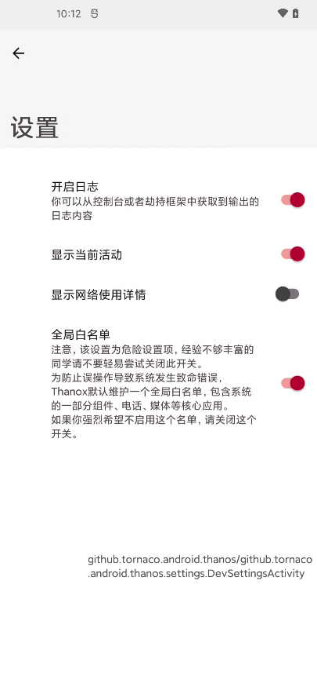

<!-- more -->

## 功能介绍

移花接木可以配置应用活动之间的跳转。在使用之前需要了解Android里常见的几个概念。

&nbsp;

&nbsp;


**活动 - Activity**

Android世界里，页面通常都是一个叫Activity（中文暂且翻译为活动）的东西；因此页面跳转我们现在可以统一语言：活动跳转。

&nbsp;

&nbsp;

**活动怎么标识？**

每个活动都有个标识，就好比每个网站页面有个路径一样。

Android里活动的标识格式通常为：

```java
"${包名}/${活动名}"
```

例如微信的首页活动页标识为：

```java
"com.tencent.mm/com.tencent.mm.LauncherUI"
```

&nbsp;

&nbsp;

## 有什么用?

先看一个需求：一个App有三个活动页，A、B、C；

常规下该App的启动顺序为A--->B--->C

现在小明有个需求，他不想看到 B 这个页面，他希望直接从 A 可以跳转到 C，可以吗？


可以！

&nbsp;

&nbsp;

## 怎么用?

按照上面的例子，在活动启动的时候，只要想办法把 B 换成 C 不就行了；也就是偷梁换柱，移花接木。

因此移花接木功能里，你只要知道 B 和 C 的活动页，就可以新增一条配置，把 B 换成 C。

&nbsp;

**举例如图：**


**那么怎么知道这些App的活动页都是什么呢？**

贴心的开发者为你准备了这个功能，打开Thanox设置---开发者---显示当前活动；此后应用的每个活动都会以浮窗展示，点击浮窗可以复制活动标识。



