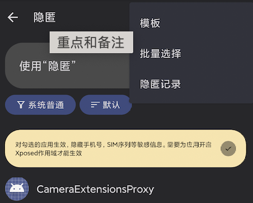

<!-- more -->

## 功能介绍
隐匿可以针对选中的app隐藏你的SIM卡、序列号等一些敏感信息

## 使用说明
首先点击右上角的模板菜单，创建一个模板，一个模板就类似于你的一套身份。

模板创建完后，如果你想对某个应用应用隐匿，那么需要做两件事：

1. Xposed作用域中勾选该App（下图中以 “2018年Pixel壁纸” 为例）
2. 隐匿应用列表中对该应用选择一个模板

